<!-- donation:eth:start -->
<div align="center">

## Support Development

If this project helps your work, support ongoing maintenance and new features.

**ETH Donation Wallet**  
`0x11282eE5726B3370c8B480e321b3B2aA13686582`

<a href="https://etherscan.io/address/0x11282eE5726B3370c8B480e321b3B2aA13686582">
  
</a>

_Scan the QR code or copy the wallet address above._

</div>
<!-- donation:eth:end -->


<div align="center">




**Fast semantic arXiv paper search with AI-powered summaries — no login required.**

### _"Research papers, decoded.."_

</div>

## Features

- **Hybrid Search** — Combines keyword (BM25) and semantic (vector) search for accurate results
- **Advanced Filtering** — Filter by author, citation count, category, and date range (day/week/month)
- **RSS Feed** — Subscribe to recent papers with AI summaries at `/rss.xml` (1-hour cache, 20 papers)
- **AI Summaries** — Pre-generated summaries with TL;DR, key contributions, methods, and limitations
- **Related Papers** — Discover similar papers through semantic similarity
- **Topic Browsing** — Curated collections for popular research areas
- **Citation Tracking** — Real-time citation counts from Semantic Scholar with automatic updates
- **Paper Collections** — Organize bookmarks into named collections with JSON/BibTeX export
- **Paper Comparison** — Side-by-side comparison of up to 4 papers
- **Zero Latency AI** — All summaries pre-computed, served from edge cache
- **No Login Required** — Instant access to all features

## Architecture

Built on Cloudflare's edge platform for global performance:

- **Frontend**: Next.js deployed as a **Cloudflare Worker** (via OpenNext + `main` + `assets` mode)
- **API**: Cloudflare Workers
- **Database**: Cloudflare D1 (SQLite)
- **Vector Search**: Cloudflare Vectorize
- **Cache**: Cloudflare KV
- **AI**: Workers AI (Llama 3.1 + BGE embeddings) for live inference; local Ollama for bulk ingestion

> **Deployment note**: The frontend is deployed as a Worker (not Cloudflare Pages) to avoid the
> per-request nonce injection that Pages unconditionally adds to `script-src`, which breaks the
> app's CSP.

### System Design

```
Browser → Next.js Worker → API Worker → KV Cache → D1 Database
                                            ↓
                                       Vectorize
                                            ↑
                                  Ingest Worker (Cron)
                                            ↑
                              Workers AI  /  local Ollama
```

## Data Pipeline

Papers flow through a two-stage pipeline:

1. **Fetch** — Ingest worker polls the arXiv API on a cron schedule and writes new papers to D1 with `summary_ready = 0`.
2. **Summarise** — Either the ingest worker (Workers AI, rate-limited) or the local bulk script (Ollama, unlimited) generates structured summaries and embeddings, then flips `summary_ready = 1`.

### Bulk Local Processing

When remote Workers AI hits rate limits, use the local Ollama pipeline to catch up:

```bash
# Process all pending/failed papers from remote D1 using local Ollama
ADMIN_SECRET=<secret> npx tsx scripts/retry-failed-local.ts

# Push a fully-processed local DB up to remote D1 + Vectorize
ADMIN_SECRET=<secret> npx tsx scripts/push-local-to-remote.ts
```

Both scripts use the **D1 REST API** directly (no `wrangler` subprocess per paper), which is ~100× faster than the naive approach and avoids shell-escaping issues with special characters in paper text.

**Ollama models used locally:**
| Role | Model |
|------|-------|
| Summarisation | `gemma4:e4b` (8 B, Q4\_K\_M) |
| Embeddings | `nomic-embed-text` (137 M, F16) |


## Quick Start

### Prerequisites

- Node.js 18+
- Cloudflare account (free tier works)
- Wrangler CLI: `npm install -g wrangler`

### Installation

```bash
git clone https://github.com/yourusername/arxiv-explorer.git
cd arxiv-explorer
npm install
wrangler login

# Create infrastructure
wrangler d1 create arxiv-explorer
wrangler kv:namespace create CACHE
wrangler vectorize create arxiv-papers --dimensions=768 --metric=cosine

# Update wrangler config files with your IDs
# Edit: wrangler.api.toml, wrangler.ingest.toml, wrangler.jsonc

# Apply database schema
wrangler d1 execute arxiv-explorer --remote --file=migrations/schema.sql

# Copy and fill env file
cp .env.local.example .env.local
```

### Development

```bash
npm run dev                                  # Next.js dev server
wrangler dev --config wrangler.api.toml      # API worker
wrangler dev --config wrangler.ingest.toml   # Ingest worker
```

Visit [http://localhost:3000](http://localhost:3000)

### Deployment

```bash
./deploy.sh

# Or individually:
npm run deploy          # Next.js frontend (Worker mode)
npm run deploy:api      # API worker
npm run deploy:ingest   # Ingest worker
```

## Project Structure

```
├── app/                        # Next.js pages
│   ├── page.tsx               # Home
│   ├── search/                # Search results
│   ├── paper/[id]/            # Paper detail
│   └── topic/[slug]/          # Topic pages
├── src/
│   ├── api-worker/            # API endpoints
│   │   └── routes/
│   │       ├── search.ts      # Hybrid search
│   │       ├── paper.ts       # Paper details
│   │       ├── related.ts     # Related papers
│   │       └── admin.ts       # Vectorize + maintenance (auth-gated)
│   ├── ingest-worker/         # Background processing
│   │   ├── fetch-arxiv.ts
│   │   ├── generate-summary.ts
│   │   ├── generate-embedding.ts
│   │   └── pipeline.ts
│   └── shared/                # Types & utils
├── scripts/
│   ├── push-local-to-remote.ts   # Sync local DB → remote D1 + Vectorize
│   ├── retry-failed-local.ts     # Reprocess pending papers via Ollama
│   ├── bulk-ingest.ts            # Full bulk ingest pipeline
│   ├── backfill-categories.ts    # Backfill paper_categories table
│   └── upload-embeddings.ts      # Standalone Vectorize uploader
├── migrations/
│   └── schema.sql             # Canonical D1 schema (single source of truth)
└── wrangler.*.toml            # Cloudflare config per service (api, ingest, jsonc for frontend)
```

## API Reference

```
GET  /api/search?q=attention+mechanisms              # Hybrid BM25 + semantic search
GET  /api/search?q=...&author=Hinton                  # Filter by author (substring match)
GET  /api/search?q=...&minCitations=10                # Filter by minimum citations
GET  /api/search?q=...&category=cs.LG                 # Filter by arXiv category
GET  /api/search?q=...&date=week                      # Filter by date (day/week/month)
GET  /api/search?q=...&author=X&minCitations=Y&...    # Combine multiple filters
GET  /api/paper/:id                                   # Paper detail + summary
GET  /api/paper/:id/related                           # Semantically similar papers
GET  /api/paper/:id/citations                         # Citation count from Semantic Scholar
GET  /api/trending                                    # Trending papers (KV cached)
GET  /api/topic/:slug                                 # Topic paper collection
GET  /rss.xml                                         # RSS feed (20 recent papers, 1h cache)
GET  /compare?ids=id1,id2,id3                         # Compare up to 4 papers side-by-side

POST /admin/vectorize/upsert                          # Bulk embed upsert (x-admin-secret)
POST /admin/retry-failed                              # Reset summary_ready=2 → 0
```

## Configuration

### Environment Variables

```bash
# .env.local
NEXT_PUBLIC_API_BASE=https://arxiv-api.yourdomain.workers.dev
API_BASE=https://arxiv-api.yourdomain.workers.dev
```

### Ingestion Settings (`wrangler.ingest.toml`)

```toml
[vars]
ARXIV_FETCH_CATEGORIES = "cs.LG,cs.CL,cs.CV,stat.ML"
ARXIV_FETCH_LIMIT_PER_CATEGORY = "30"
INGEST_MAX_CONCURRENT = "5"
```

### Admin Secret

Required for Vectorize upserts and maintenance endpoints:

```bash
wrangler secret put ADMIN_SECRET --config wrangler.api.toml
```


## Database Schema

### papers
- arXiv metadata (id, title, authors, abstract, categories, dates, URLs)
- `summary_ready`: `0` = pending · `1` = done · `2` = failed

### summaries
- `tldr` — one-sentence result
- `key_contributions` — JSON array
- `methods` — JSON array
- `limitations` — JSON array
- `beginner_explain` — plain-language paragraph
- `technical_summary` — researcher-level paragraph
- `model_version` — which model generated it

### Supporting tables
- `paper_categories` — normalised category rows (indexed for topic queries)
- `papers_fts` — FTS5 virtual table with insert/update/delete triggers
- `embeddings_meta` — tracks embedding generation per paper
- `related_papers` — pre-computed top-8 semantic neighbours

### Rebuild from scratch

```bash
# Apply canonical schema (wipes and recreates all tables)
wrangler d1 execute arxiv-explorer --remote --file=migrations/schema.sql

# Push local data (970 papers, summaries, categories, FTS, embeddings)
ADMIN_SECRET=<secret> npx tsx scripts/push-local-to-remote.ts
```

## Performance

- **Search**: <300 ms (KV cache hit) · <600 ms (D1 fallback)
- **Paper detail**: <200 ms (KV cache hit) · <500 ms (D1 fallback)
- **Cache hit rate**: >85 %
- **DB size**: ~970 papers, 1 961 category rows, 970 FTS rows
- **Throughput**: 33 req/s under mixed load
- **Uptime**: 100% (production tested)

## New Features (2026-06-01)

### Citation Tracking
- **Endpoint**: `GET /api/paper/:id/citations`
- **Source**: Semantic Scholar API
- **Updates**: Automatic hourly cron (50 papers per run, 7-day refresh cycle)
- **Storage**: `citation_count` and `citations_updated_at` fields in D1
- **Rate Limiting**: 3-second delay between requests

### Paper Collections
- **Location**: `/bookmarks` page
- **Storage**: Client-side localStorage
- **Features**:
  - Create named collections
  - Assign bookmarks to collections
  - Export as JSON or BibTeX
  - Export all bookmarks or by collection
- **Capacity**: 100 bookmarks (soft cap), 90-day TTL

### Advanced Search Filters
- **Author Filter**: `?author=Hinton` — substring match across all authors
- **Citation Filter**: `?minCitations=10` — minimum citation threshold
- **Category Filter**: `?category=cs.LG` — arXiv category code (cs.LG, cs.CL, cs.CV, etc.)
- **Date Filter**: `?date=week` — time window (day/week/month)
- **Combined Filters**: All filters work together and with hybrid search
- **Caching**: Separate KV cache keys per filter combination (2h TTL)
- **Example**: `/api/search?q=transformer&author=Vaswani&minCitations=100&category=cs.LG&date=month`

### RSS Feed
- **Endpoint**: `/rss.xml`
- **Content**: 20 most recent papers with AI-generated summaries
- **Format**: RSS 2.0 with full TL;DR, key contributions, and methods
- **Cache**: 1-hour TTL via Cloudflare KV
- **Use Case**: Subscribe in your RSS reader to stay updated on new papers
- **Example**: `https://arxiv-explorer.yourdomain.com/rss.xml`

### Paper Comparison
- **Route**: `/compare?ids=id1,id2,id3`
- **Capacity**: 1-4 papers side-by-side
- **Sections**: TL;DR, Key Contributions, Methods, Limitations, Technical Summary
- **Layout**: Responsive grid adapts to paper count
- **Example**: `/compare?ids=2605.30353,2302.13971,2303.08774`

## Testing

### Integration Tests
```bash
./test-integration.sh      # Core functionality tests
./test-new-features.sh     # New features tests
```

### Stress Testing
```bash
./test-stress.sh           # Production load testing
```

**Latest Test Results** (2026-06-01):
- Search: 200-300ms response time
- Cache: 232ms average hit time
- Throughput: 33 req/s
- Error rate: 0%
- See `TEST_RESULTS.md` for full report

## Troubleshooting

### Check paper counts

```bash
npx wrangler d1 execute arxiv-explorer --remote --config wrangler.api.toml \
  --command="SELECT summary_ready, COUNT(*) as cnt FROM papers GROUP BY summary_ready"
```

### Retry pending/failed papers locally

```bash
ADMIN_SECRET=<secret> LIMIT=50 npx tsx scripts/retry-failed-local.ts
```

### Push local DB to remote

```bash
ADMIN_SECRET=<secret> npx tsx scripts/push-local-to-remote.ts
```

### Watch live logs

```bash
wrangler tail arxiv-api    --format=pretty   # API worker
wrangler tail arxiv-ingest --format=pretty   # Ingest worker
```

### Reset database

```bash
./reset-and-ingest.sh
```

## Design Notes

### Why Worker instead of Pages

Deploying the Next.js frontend as a Cloudflare Worker (via OpenNext `main` + `assets`) rather than Cloudflare Pages avoids the per-request nonce that Pages unconditionally injects into `script-src`. That injection happens at the CDN layer before the response reaches the browser, so no amount of middleware or `_headers` file can override it. The Worker deployment has no such injection and serves the app's own CSP intact.

### Search Algorithm

1. Normalise query
2. Check KV cache (2 h TTL)
3. Parallel:
   - D1 FTS keyword search (BM25, title boosted 10:1:5)
   - Vectorize semantic search (query embedding cached 24 h)
4. Merge (25 % keyword · 75 % semantic), deduplicate
5. Return top 10, write to KV

### Caching Strategy

- **Lazy KV writes**: paper detail written to KV on first access, not at ingestion
- **Query embedding cache**: popular search vectors cached 24 h in KV
- **Trending KV cache**: 60-minute TTL, auto-invalidated on new papers

### AI Processing

- Single consolidated prompt per paper → structured JSON output
- Workers AI uses `@cf/meta/llama-3.1-8b-instruct` for summaries, `@cf/baai/bge-base-en-v1.5` for embeddings
- Local Ollama fallback: `gemma4:e4b` (summaries) + `nomic-embed-text` (embeddings)
- Failed papers marked `summary_ready = 2` and retried on next run


## Contributing

1. Fork the repository
2. Create a feature branch
3. Make your changes
4. Add tests if applicable
5. Submit a pull request

## License

This project is licensed under the **Business Source License 1.1 (BSL 1.1)**.

- ✅ Free for personal, academic, and non-commercial use
- ❌ Commercial use requires a separate license
- 📅 Converts to **MIT License** on **2029-06-01**

See [LICENSE.md](LICENSE.md) for full terms, or [contact the author](https://teycirbensoltane.tn) for commercial licensing.

## Acknowledgments

- [arXiv](https://arxiv.org) for open access to research papers
- [Cloudflare](https://cloudflare.com) for the edge platform
- [Next.js](https://nextjs.org) / [OpenNext](https://opennext.js.org) for the framework + Worker adapter
- [Ollama](https://ollama.com) for local model inference

---

<!-- related-projects:start -->
## 🌐 Related Projects

Explore more privacy-first and security tools:

### Privacy & Encryption
- **[Timeseal](https://github.com/Teycir/Timeseal)** - Time-locked encryption vault with Dead Man's Switch. AES-256 split-key crypto, ephemeral seals.
- **[Sanctum](https://github.com/Teycir/Sanctum)** - Zero-trust encrypted vault with cryptographic plausible deniability. XChaCha20-Poly1305, Argon2id.
- **[GhostChat](https://github.com/Teycir/GhostChat)** - True P2P encrypted chat via WebRTC. No servers, no storage, self-destructing messages.
- **[xmrproof](https://github.com/Teycir/xmrproof)** - Monero payment verification, 100% client-side.
- **[GhostReceipt](https://github.com/Teycir/GhostReceipt)** - Anonymous receipt generation with zero-knowledge proofs.

### Security Tools
- **[BurpAPISecuritySuite](https://github.com/Teycir/BurpAPISecuritySuite)** - Burp Suite extension for API security testing. 15 attack types, 108+ payloads, BOLA/IDOR detection.
- **[Mcpwn](https://github.com/Teycir/Mcpwn)** - Automated security scanner for Model Context Protocol servers. Detects RCE, path traversal, prompt injection.
- **[DiffCatcher](https://github.com/Teycir/DiffCatcher)** - Git repo discovery, diff capture, code element extraction.
- **[HoneypotScan](https://github.com/Teycir/HoneypotScan)** - Honeypot detection service for security research.
- **[CheckAPI](https://github.com/Teycir/CheckAPI)** - LLM API key validator for multiple providers. Privacy-first, client-side validation.
- **[SeekYou](https://github.com/Teycir/SeekYou)** - Host intelligence aggregator — unified OSINT across 15 sources for IPs, domains, and ASNs.

### MCP Security Servers
- **[burp-mcp-server](https://github.com/Teycir/burp-mcp-server)** - MCP server for Burp Suite Professional. Vulnerability scanning via AI assistants.
- **[nuclei-mcp](https://github.com/Teycir/nuclei-mcp)** - MCP server for Nuclei. Multi-target scanning, severity filtering.
- **[nmap-mcp](https://github.com/Teycir/nmap-mcp)** - MCP server for Nmap. Stealth recon, vuln/NSE scanning.
- **[frida-mcp](https://github.com/Teycir/frida-mcp)** - MCP server for Frida. Dynamic instrumentation, SSL pinning bypass.
<!-- related-projects:end -->

---

<!-- services:start -->
## 💼 Services Offered

- 🔒 **Privacy-First Development** - P2P applications, encrypted communication, zero-knowledge systems
- 🚀 **Web Application Development** - Full-stack development with Next.js, React, TypeScript
- 🔧 **Edge Computing Solutions** - Cloudflare Workers, Pages, D1, KV, Durable Objects
- 🛡️ **Security Tool Development** - Burp extensions, penetration testing tools, automation frameworks
- 🤖 **AI Integration** - LLM-powered applications, intelligent automation, custom AI solutions
- 🔍 **OSINT & Threat Intelligence** - Custom reconnaissance tools, threat feed aggregation, IOC correlation

**Get in Touch**: [teycirbensoltane.tn](https://teycirbensoltane.tn) | Available for freelance projects and consulting
<!-- services:end -->

---

<!-- attribution:start -->
<div align="center">

**Built with 💚 by [Teycir Ben Soltane](https://teycirbensoltane.tn)**

</div>
<!-- attribution:end -->
